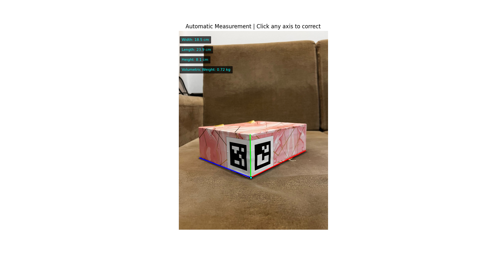
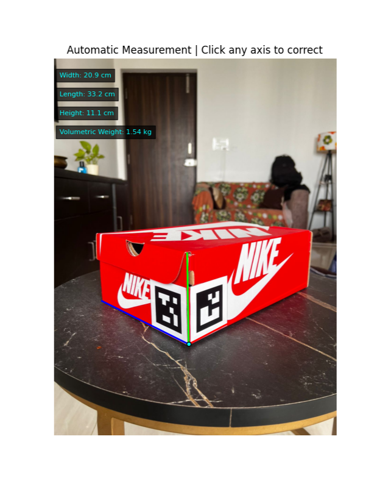

## CubitScan

CubitScan is a Python-based image processing tool designed to calculate the volumetric weight of shipping containers and boxes using computer vision techniques. This project leverages aruco marker stickers with a **1cm thick border** for improved detection across differently colored boxes, making the system more robust and accurate than previous versions.

### Project Aim
The main goal is to help shipping companies and logistics services measure the length, width, and height of customer-provided containers using images, especially when container dimensions are unknown.

### How It Works
- **Aruco Markers:** Attach two aruco marker stickers (now with a 1cm thick border for enhanced detection) perpendicular to each other on the box. These serve as reference points to measure dimensions.
- **Camera Calibration:** Before measurement, calibrate your camera using a chessboard matrix to capture intrinsic parameters. Calibration is a one-time process, and saved calibration files can be reused for later measurements.
- **Measurement:** Capture an image of the container with aruco markers. The application detects the markers, calculates the dimensions, and computes the volumetric weight.

### Features
- No physical measurement tools required—uses computer vision and aruco markers with high-contrast thick borders.
- Device calibration for accurate measurements.
- Loads previously saved calibration files to save time.
- Designed for cross-device compatibility (works with different cameras via image input).
- Robust detection on various colored surfaces.
- Useful for logistics and shipping companies pricing by volumetric weight.

### Usage
1. **Calibrate your camera:**
   - Use a chessboard matrix and follow the instructions in the calibration module.
2. **Prepare your box:**
   - Stick 2 aruco marker stickers perpendicularly on the box (ensure each sticker has a 1cm thick border).
3. **Capture and process the image:**
   - Run the main script, provide the calibration file, and an image of the container.
4. **Get volumetric weight:**
   - The program outputs the dimensions and calculated volumetric weight.

### Limitations
- Efficiency may vary depending on image quality and marker detection.
- Not an industrial solution, but a novel approach for quick estimates.
- **High-end edge detection is not implemented** to keep computation cost and time minimal; axes lengths in the displayed images may require manual correction.

### Example Output
- **Note:** Axes lengths in the displayed image were manually corrected.

#### Example 1

- **Height:** 8.2 cm
- **Length:** 23.5 cm
- **Width:** 18.7 cm
- **Volumetric Weight:** 0.72 kg
- **Square Size (Aruco):** 5 cm

#### Example 2

- **Height:** 11 cm
- **Length:** 33.5 cm
- **Width:** 20.8 cm
- **Volumetric Weight:** 1.53 kg
- **Square Size (Aruco):** 5 cm

### Important Notes
- Optimal results are achieved when the camera angle is 15 to 25 degrees relative to the ground plane.
- The automatic measurement system might not always find the accurate physical edges; corrections can be made by clicking on the desired axes length.
- Extending the axes length slightly outside the actual edges of the box (2-5 pixels extra) is optional and may or may not be needed depending on the image and detection accuracy.
- The new marker design with a 1cm border significantly improves detection, especially on boxes with varying colors.

